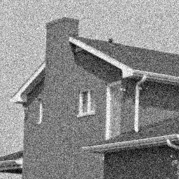

## Classical Change Point Problem ##
### Example 2

```{r fig.width = 13, fig.height = 5, echo =F}
y <- rep(c(0,1), each=50) 
x <- 1:100
z <- data.frame(x=x, y=y + rnorm(100), z= y)
ggplot(z, aes(x=x, y=y)) + geom_point()
```
--- 

## Classical Change Point Problem ##
### Example 2

```{r fig.width = 13, fig.height = 5, echo =F}
ggplot(z, aes(x=x, y=y)) + geom_point() +
    geom_line(aes(x=x[1:50],y=z[1:50]), color="blue",size=2) +
    geom_line(aes(x=x[51:100],y=z[51:100]), color="blue", size=2)
```
--- 

## Literature Survey ##
- Barry and Hartigan (1993), Erdman and Emerson (2007, 2008) - univariate change points via `library(bcp)`
- Barry and Hartigan (1994) - univariate change points on a grid
- Bai and Perron (2003), Zeileis, et al. (2001) - regression change points via `library(strucchange)`
- Muggeo (2003) - regression change points via `library(segmented)`
- Olshen, et al. (2004) - univariate change points using circular binary segmentation
- Fearnhead (2005) - Bayesian regression change points
- Loschi, et al. (2010) - Bayesian regression change points
- Killick and Eckley (2011) - univariate mean or variance change points via `library(changepoint)`
- Ross (2012) - distributional univariate change points via `library(cpm)`
- Matteson and James (2013) - multivariate change points via `library(ecp)`
- ... and others

--- &twocol

## Bayesian Change Point Analysis ##
### Barry & Hartigan (1993): A Product Partition Model

***left
<div style="font-size: 110%;">  
Partition $\rho = (S_1,\dots, S_b)$
$$y_{i:i\in S}\sim N(\theta_S, \sigma^2)$$
$$ \theta_S|\mu_0, \sigma_0^2 \sim N\left(\mu_0, \frac{\sigma_0^2}{n_S}\right)$$
<div style="color: red;">
$$f(\rho|p) = p^{b-1} (1-p)^{n-b}$$
</div>
</div>

***right
<div style="font-size: 110%;">  
$$\mu_0 \sim U(-\infty, \infty)$$
$$\pi(\sigma^2) \propto \frac{1}{\sigma^2}\;\;\;\;\sigma^2\in(0,\infty)$$
$$\pi(p) = \frac{1}{p_0}\;\;\;\;p\in (0,p_0)$$
$$\pi(w) = \frac{1}{w_0}\;\;\;\;w\in(0,w_0)$$
</div>

---

## Product Partition Models (PPMs) ##

### Hartigan (1990):
<q>
Product partition models assume that observations in different components of a random partition of the data are independent given the partition.</q>
<div class="build"> 
<div class="alert alert-info">
i.e. $y_i$ in block $S_1$ is independent of $y_j$ in $S_2$ given partition $\rho$ and the other parameters.
</div>
</div>

--- &twocol

## Bayesian Change Point Analysis ##
- Univariate change point analysis (Barry & Hartigan 1992)
- Implemented by Erdman & Emerson (2007, 2008) in `library(bcp)`

*** left 
### Example 1 (revisited)
```{r fig.width = 6, fig.height = 5, echo =F}
set.seed(5)
y <- rep(c(0,3), each=50) 
x <- 1:100
z <- data.frame(x=x, y=y + rnorm(100), z= y)
ggplot(z, aes(x=x, y=y)) + geom_point() +
    geom_line(aes(x=x[1:50],y=z[1:50]), color="blue",size=2) +
    geom_line(aes(x=x[51:100],y=z[51:100]), color="blue", size=2)

```

*** right
### Example 1 (`bcp` output)
```{r fig.width = 6, fig.height = 5, echo =F}
plot(bcp(z$y), lwd=2)

```


--- .segue .dark

## Extensions

--- &twocol

## Simple linear regression ##

*** left 
### Example 3
```{r fig.width = 6, fig.height = 6, echo =F}
set.seed(5)
x <- 1:100
y <- c(x[1:40]*0.1+2, x[41:50]*-0.3+10, x[51:100]*-0.1+5) 
#plot(y)
z <- data.frame(x=x, y=y + rnorm(100), z= y)
ggplot(z, aes(x=x, y=y)) + geom_point() +
   geom_line(data=z[1:40,], aes(x=x, y=z), color="blue",size=2) +
      geom_line(data=z[41:50,], aes(x=x, y=z), color="blue",size=2)+
    geom_line(data=z[51:100,], aes(x=x, y=z), color="blue",size=2)

```

*** right
### Example 3 (posterior output)
```{r fig.width = 6, fig.height = 6, echo =F, results='hide'}
detach(package:bcp)
library(bcp2)
tmp <- bcp(z$y, z$x)
plot(tmp)

```

--- &twocol

## Multivariate change point

*** left 

### Example 4

```{r fig.width = 6, fig.height = 5, echo =F, results='hide'}
detach(package:bcp2)
library(bcpM)
set.seed(2339)
p <- 3
meanSD <- 1
means1 <- rnorm(p, sd=meanSD)
means2 <- rnorm(p, mean=5, sd=meanSD)
means3 <- rnorm(p, sd=meanSD)
trueparams <- rbind(matrix(rep(means1, each=4), ncol=p),
                    matrix(rep(means2, each=1), ncol=p),
                    matrix(rep(means3, each=55), ncol=p))
y <- trueparams+rnorm(length(trueparams))
z <- data.frame(x = rep(1:nrow(y), p),
                dim = as.factor(rep(1:p, each=nrow(y))),
                val = as.numeric(y), truep = as.numeric(trueparams))
firstgrp <- c(1:4, 61:64, 121:124)
secondgrp <- c(5, 65, 125)
thirdgrp <- c(6:60, 66:120, 126:180)
ggplot(z, aes(x=x, y=val, group = dim, color=dim)) + geom_point() +
                  geom_line(data=z[firstgrp,], aes(x=x,y=truep, color=dim), size=2) +
                  geom_point(data=z[secondgrp,],  aes(x=x,y=truep, color=dim), size=3, shape=2) +
                  geom_line(data=z[thirdgrp,], aes(x=x,y=truep, color=dim),size=2)

```

*** right

### Example 4 (posterior output)

```{r fig.width = 6, fig.height = 5, echo =F, results='hide'}
tmp <- bcp(y)
plot(tmp)

```


--- .segue .dark

## Moving to a Grid

--- &twocol

## Change Points on a Grid##
### Barry and Hartigan (1994)
*** left 

### Example 5

```{r fig.width = 6, fig.height = 5, echo =F, results='hide'}
detach(package:bcpM)
library(PPMGraph4)
N <- 20
set.seed(5)
trueparams <- matrix(0, N, N)
trueparams[1:(N/2),1:(N/2)] <- 2
trueparams[(N/2+1):N,(N/2+1):N] <- 2
adj <- makeAdjGrid(N)
y <- as.numeric(trueparams+rnorm(length(trueparams)))
tmp <- data.frame(z=y, x = rep(1:N, each=N), y = rep(1:N, times=N))
txtdf <- data.frame(x=c(5.5, 5.5, 15.5, 15.5), y=c(5.5, 15.5, 5.5, 15.5),
                      lab = c(2, 0, 0, 2))
ggplot(tmp, aes(x,y)) + geom_tile(aes(fill = z), color="white") +
  scale_fill_gradientn(limits=c(-4,5), colours=c("white", "steelblue"))+
  geom_segment(aes(x=10.5, y=0.5, xend=10.5, yend=20.5))+
  geom_segment(aes(x=0.5, y=0.5, xend=0.5, yend=20.5))+
  geom_segment(aes(x=20.5, y=0.5, xend=20.5, yend=20.5))+
  geom_segment(aes(x=0.5, y=0.5, xend=20.5, yend=0.5))+
  geom_segment(aes(x=0.5, y=10.5, xend=20.5, yend=10.5))+
  geom_segment(aes(x=0.5, y=20.5, xend=20.5, yend=20.5))+
  geom_text(aes(x, y, label=lab), data=txtdf, size=20)
```

*** right

### Example 5 (posterior means)

```{r fig.width = 6, fig.height = 5, echo =F, results='hide'}
tmp2 <- ppm(y, adj, p1=0, burnin=500, mcmc=1000)
tmp3 <- data.frame(pmean=tmp2[[1]]$pmean, x = rep(1:N, each=N), y = rep(1:N, times=N))
ggplot(tmp3, aes(x,y)) + geom_tile(aes(fill = pmean), color="white") +
  scale_fill_gradientn(limits=c(-4,5), colours=c("white", "steelblue"))
```

--- 
## Change Points on a Grid ##
What does it mean to have a change point on a grid?

### In 1 dimension

```{r fig.width = 13, fig.height = 5, echo =F, results='hide'}
library(igraph)
g <- graph(c(1,2,2,3), directed=F)
lay <- cbind(c(1:3), 5)
V(g)$name <- paste("Y", 1:3, sep="")
plot(g, layout=lay, vertex.size=60, edge.width=4, rescale=F, 
      ylim=c(4,6), xlim=c(0,4), vertex.label.cex=2)
lines(c(1.5, 1.5), c(4,6), lwd=3, col="blue")
lines(c(0, 0), c(4,6), lwd=3, col="blue")
lines(c(4, 4), c(4,6), lwd=3, col="blue")
lines(c(0, 4), c(4,4), lwd=3, col="blue")
lines(c(0, 4), c(6,6), lwd=3, col="blue")

```

--- 

## Change Points on a Grid ##
What does it mean to have a change point on a grid?

### In 2 dimensions

```{r fig.width = 13, fig.height = 5, echo =F, results='hide'}
g <- graph.lattice(c(3,3), directed=F)
lay <- cbind(rep(1:3,each=3), rep(1:3,times=3))
V(g)$name <- paste("Y", 1:9, sep="")
plot(g, layout=lay, vertex.size=80, edge.width=4, rescale=F, 
      ylim=c(0.5,3.5), xlim=c(0.5,3.5), vertex.label.cex=2)
lines(c(1.5, 1.5), c(0.5,3.5), lwd=3, col="blue")
lines(c(1.5, 3.5), c(2.5, 2.5), lwd=3, col="blue")
lines(c(0.5, 3.5), c(0.5, 0.5), lwd=3, col="blue")
lines(c(0.5, 3.5), c(3.5, 3.5), lwd=3, col="blue")
lines( c(0.5, 0.5), c(0.5, 3.5), lwd=3, col="blue")
lines(c(3.5, 3.5),  c(0.5, 3.5), lwd=3, col="blue")
```

---
## Change Points on a Grid ##
The model only differs in the prior.

>  - Boundary length $l(\rho)$
<div style="font-size: 150%;">  
  $$ f(\rho)\propto \alpha^{l(\rho)} \;\;\;\;\; \alpha\in(0,1)$$
</div>
>  - Small $\alpha$ encourages shorter boundaries
>  - Results are very sensitive to choice of $\alpha$ 

However, the MCMC implementation is much more complicated.

--- &twocol

## Application
### Image Restoration

*** left
### Example 6
```{r fig.width = 6, fig.height = 5, echo =F, results='hide'}
#library(jpeg)
#x <- readJPEG("~/Desktop/PPMGraph/surelet.jpg")
#writeJPEG(x[,,1], "~/Desktop/PPMGraph/JSM2013/surelet-gray1.jpg")
```


*** right
### Example 6 (posterior means)
```{r fig.width = 6, fig.height = 5, echo =F, results='hide'}
#tmp <- readRDS("~/Desktop/PPMGraph/surelet-out.rds")[[1]]
#image(t(matrix(tmp$pmean, dim(x)[1], dim(x)[2])), col=gray(seq(0,1,length.out=12)))
#writeJPEG(matrix(tmp$pmean, dim(x)[1], dim(x)[2]), "~/Desktop/PPMGraph/JSM2013/surelet-gray1-out.jpg")
```


--- &twocol

## Application: Multivariate
### Image Restoration

*** left
### Example 7 (RGB channels)
```{r fig.width = 6, fig.height = 5, echo =F, results='hide'}
#library(jpeg)
#x <- readJPEG("~/Desktop/PPMGraph/surelet.jpg")
#writeJPEG(x[,,1], "~/Desktop/PPMGraph/JSM2013/surelet-gray1.jpg")
```


*** right
### Example 7 (posterior means)
```{r fig.width = 6, fig.height = 5, echo =F, results='hide'}
#tmp <- readRDS("~/Desktop/PPMGraph/surelet-out-multi.rds")[[1]]
#img <- x
#for (i in 1:3)
#  img[,,i] <- tmp$pmean[,i]
#image(t(matrix(tmp$pmean, dim(x)[1], dim(x)[2])), col=gray(seq(0,1,length.out=12)))
#writeJPEG(y, "~/Desktop/PPMGraph/JSM2013/surelet-tmp.jpg")
```


---

## Application: Multivariate
### Ad-Hoc Image Segmentation (via k-means)

### Example 7 (segments)
```{r fig.width = 6, fig.height = 5, echo =F, results='hide'}
#writeJPEG(matrix(tmp$pboundary, dim(x)[1], dim(x)[2]), "~/Desktop/PPMGraph/JSM2013/surelet-out-bound.jpg")
```
<div class="row-container">
  <div class="span3">

  
  </div>
 <div class="span3">

  
  </div>
  <div class="span3">

  
  </div>
</div>

--- &twocol

## From Grid to Graph

*** left
### Example 8

```{r fig.width = 6, fig.height = 5, echo =F, results='hide'}
library(igraph)
set.seed(5)
p <- 0.6
adj <- matrix(0, 20, 20)
adj[1:10,1:10] <- rbinom(100, 1, p)
adj[11:20, 11:20] <- rbinom(100, 1, p)
adj[5,15] <- adj[6,18] <- adj[2, 11:15] <- 1
adj[lower.tri(adj)] <- t(adj)[lower.tri(adj)]
diag(adj) <- 0
y <- rep(c(0,3), each = 10) + rnorm(20)
g <- graph.adjacency(adj, mode="undirected")
V(g)$name <- round(y,1)
y.rounded <- round(y,1)
y.scale <- as.character(seq(0, 3, by=0.1))
cols <- rev(heat.colors(length(y.scale)))
lay <-layout.fruchterman.reingold(g, niter=100000)
V(g)$color <- cols[match(as.character(rep(c(0,3), each=10)), y.scale)]
plot(g, edge.width=4, layout=lay, vertex.size=30)
lines(c(-1.3, 1.3), c(0.115, 0.115), lwd=2, col="blue")
```

*** right
### Example 8 (change point output)

```{r fig.width = 6, fig.height = 5, echo =F, results='hide'}
library(PPMGraph4)
set.seed(25)
g2 <- g
adj2 <- list()
for (i in 1:20) {
  adj2[[i]] <- which(adj[i,] ==1) -1
}
tmp <- ppm(y, adj2, a0=0.5, p1=1, burnin=1000, mcmc=500)[[1]]
V(g2)$name <- round(tmp$pmean,1)
tmp.rounded <- round(tmp$pmean,1)
V(g2)$color <- cols[match(as.character(tmp.rounded), y.scale)]
plot(g2, edge.width=4, layout=lay, vertex.size=30)
```


--- .segue .dark

## Future Directions

--- 

## Next Steps
1. Refining and improving the graphical change point method for both the univariate and multivariate cases.
2. Extending the graphical change point method to fitting regressions.

--- .segue .dark

## Thank You ##

--- 

## Acknowledgements
I would like to thank my advisors Jay Emerson and Joseph Chang for their 
support and neverending wealth of ideas. Also, I would also like to thank my academic
grandfather, John Hartigan, for pioneering the concept of product partition models.

---

## References

- Barry, Daniel, and John A. Hartigan. "A Bayesian analysis for change point problems." Journal of the American Statistical Association 88.421 (1993): 309-319.
- Hartigan, John A. "Partition models." Communications in Statistics-Theory and Methods 19.8 (1990): 2745-2756.
- Barry D, Hartigan JA. A product partition model for image restoration. In New Directions in Statistical Data Analysis and Robustness, MorgenthalerS (ed.). Birkhäuser: Basel, 1994.
- Erdman, Chandra, and John W. Emerson. "bcp: An R package for performing a Bayesian analysis of change point problems." Journal of Statistical Software 23.3 (2007): 1-13.
- Erdman, Chandra, and John W. Emerson. "A fast Bayesian change point analysis for the segmentation of microarray data." Bioinformatics 24.19 (2008): 2143-2148.
- Matteson, David S., and Nicholas A. James. "A nonparametric approach for multiple change point analysis of multivariate data." arXiv preprint arXiv:1306.4933 (2013).
- Bai, Jushan, and Pierre Perron. "Computation and analysis of multiple structural change models." Journal of Applied Econometrics 18.1 (2003): 1-22.

---

## References
- Loschi, Rosangela H., Jeanne G. Pontel, and Frederico RB Cruz. "Multiple change-point analysis for linear regression models." Chilean Journal of Statistics 1 (2010): 93-112.
- Fearnhead, Paul. "Exact Bayesian curve fitting and signal segmentation." Signal Processing, IEEE Transactions on 53.6 (2005): 2160-2166.
- Killick, Rebecca, and Idris A. Eckley. "Changepoint: an R package for changepoint analysis." Lancaster University (2011).
- Ross, Gordon J. "Parametric and Nonparametric Sequential Change Detection in R: The cpm package." Journal of Statistical Software, 2012.
- Hegarty, Avril, and Daniel Barry. "Bayesian disease mapping using product partition models." Statistics in medicine 27.19 (2008): 3868-3893.
- Muggeo, Vito MR. "Estimating regression models with unknown break‐points." Statistics in medicine 22.19 (2003): 3055-3071.
- Olshen, Adam B., et al. "Circular binary segmentation for the analysis of array‐based DNA copy number data." Biostatistics 5.4 (2004): 557-572.

---

## References
- Zeileis, Achim, et al. "strucchange. An R package for testing for structural change in linear regression models." (2001).
