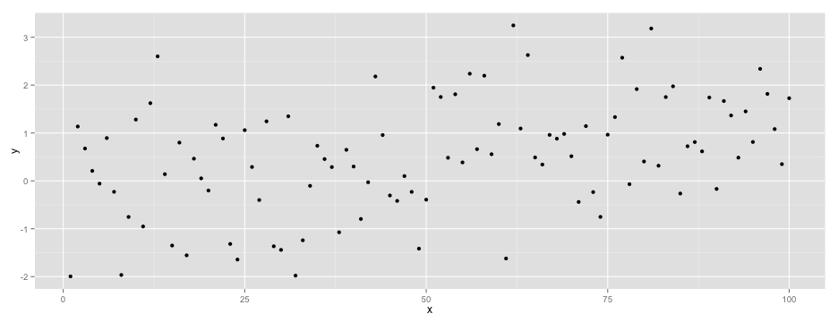
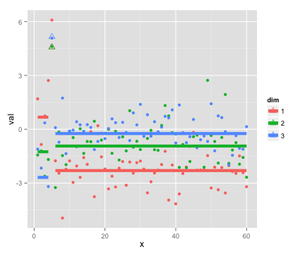
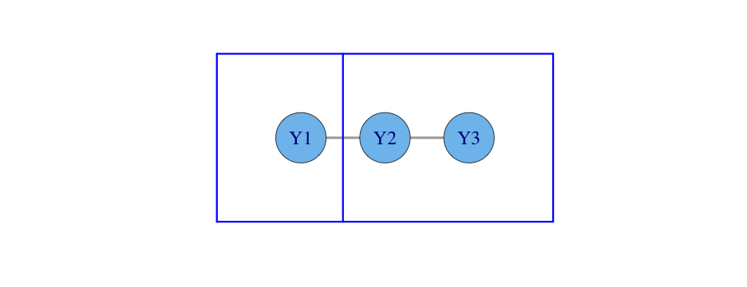

## Classical Change Point Problem ##
### Example 2

 

--- 

## Classical Change Point Problem ##
### Example 2

 

--- 

## Literature Survey ##
- Barry and Hartigan (1993), Erdman and Emerson (2007, 2008) - univariate change points via `library(bcp)`
- Barry and Hartigan (1994) - univariate change points on a grid
- Bai and Perron (2003), Zeileis, et al. (2001) - regression change points via `library(strucchange)`
- Muggeo (2003) - regression change points via `library(segmented)`
- Olshen, et al. (2004) - univariate change points using circular binary segmentation
- Fearnhead (2005) - Bayesian regression change points
- Loschi, et al. (2010) - Bayesian regression change points
- Killick and Eckley (2011) - univariate mean or variance change points via `library(changepoint)`
- Ross (2012) - distributional univariate change points via `library(cpm)`
- Matteson and James (2013) - multivariate change points via `library(ecp)`
- ... and others

--- &twocol

## Bayesian Change Point Analysis ##
### Barry & Hartigan (1993): A Product Partition Model

***left

  
Partition $\rho = (S_1,\dots, S_b)$
$$y_{i:i\in S}\sim N(\theta_S, \sigma^2)$$
$$ \theta_S|\mu_0, \sigma_0^2 \sim N\left(\mu_0, \frac{\sigma_0^2}{n_S}\right)$$

$$f(\rho|p) = p^{b-1} (1-p)^{n-b}$$

***right

  
$$\mu_0 \sim U(-\infty, \infty)$$
$$\pi(\sigma^2) \propto \frac{1}{\sigma^2}\;\;\;\;\sigma^2\in(0,\infty)$$
$$\pi(p) = \frac{1}{p_0}\;\;\;\;p\in (0,p_0)$$
$$\pi(w) = \frac{1}{w_0}\;\;\;\;w\in(0,w_0)$$

---

## Product Partition Models (PPMs) ##

### Hartigan (1990):
<q>
Product partition models assume that observations in different components of a random partition of the data are independent given the partition.</q>

 

i.e. $y_i$ in block $S_1$ is independent of $y_j$ in $S_2$ given partition $\rho$ and the other parameters.

--- &twocol

## Bayesian Change Point Analysis ##
- Univariate change point analysis (Barry & Hartigan 1992)
- Implemented by Erdman & Emerson (2007, 2008) in `library(bcp)`

*** left 
### Example 1 (revisited)
 

*** right
### Example 1 (`bcp` output)
 

--- .segue .dark

## Extensions

--- &twocol

## Simple linear regression ##

*** left 
### Example 3
 

*** right
### Example 3 (posterior output)
 

--- &twocol

## Multivariate change point

*** left 

### Example 4

 

*** right

### Example 4 (posterior output)

 

--- .segue .dark

## Moving to a Grid

--- &twocol

## Change Points on a Grid##
### Barry and Hartigan (1994)
*** left 

### Example 5

 

*** right

### Example 5 (posterior means)

 

--- 
## Change Points on a Grid ##
What does it mean to have a change point on a grid?

### In 1 dimension

 

--- 

## Change Points on a Grid ##
What does it mean to have a change point on a grid?

### In 2 dimensions

 

---
## Change Points on a Grid ##
The model only differs in the prior.

>  - Boundary length $l(\rho)$

  
  $$ f(\rho)\propto \alpha^{l(\rho)} \;\;\;\;\; \alpha\in(0,1)$$

>  - Small $\alpha$ encourages shorter boundaries
>  - Results are very sensitive to choice of $\alpha$ 

However, the MCMC implementation is much more complicated.

--- &twocol

## Application
### Image Restoration

*** left
### Example 6

*** right
### Example 6 (posterior means)

--- &twocol

## Application: Multivariate
### Image Restoration

*** left
### Example 7 (RGB channels)

*** right
### Example 7 (posterior means)

---

## Application: Multivariate
### Ad-Hoc Image Segmentation (via k-means)

### Example 7 (segments)

  

  
  

 

  
  

  

  
  

--- &twocol

## From Grid to Graph

*** left
### Example 8

 

*** right
### Example 8 (change point output)

 

--- .segue .dark

## Future Directions

--- 

## Next Steps
1. Refining and improving the graphical change point method for both the univariate and multivariate cases.
2. Extending the graphical change point method to fitting regressions.

--- .segue .dark

## Thank You ##

--- 

## Acknowledgements
I would like to thank my advisors Jay Emerson and Joseph Chang for their 
support and neverending wealth of ideas. Also, I would also like to thank my academic
grandfather, John Hartigan, for pioneering the concept of product partition models.

---

## References

- Barry, Daniel, and John A. Hartigan. "A Bayesian analysis for change point problems." Journal of the American Statistical Association 88.421 (1993): 309-319.
- Hartigan, John A. "Partition models." Communications in Statistics-Theory and Methods 19.8 (1990): 2745-2756.
- Barry D, Hartigan JA. A product partition model for image restoration. In New Directions in Statistical Data Analysis and Robustness, MorgenthalerS (ed.). Birkhäuser: Basel, 1994.
- Erdman, Chandra, and John W. Emerson. "bcp: An R package for performing a Bayesian analysis of change point problems." Journal of Statistical Software 23.3 (2007): 1-13.
- Erdman, Chandra, and John W. Emerson. "A fast Bayesian change point analysis for the segmentation of microarray data." Bioinformatics 24.19 (2008): 2143-2148.
- Matteson, David S., and Nicholas A. James. "A nonparametric approach for multiple change point analysis of multivariate data." arXiv preprint arXiv:1306.4933 (2013).
- Bai, Jushan, and Pierre Perron. "Computation and analysis of multiple structural change models." Journal of Applied Econometrics 18.1 (2003): 1-22.

---

## References
- Loschi, Rosangela H., Jeanne G. Pontel, and Frederico RB Cruz. "Multiple change-point analysis for linear regression models." Chilean Journal of Statistics 1 (2010): 93-112.
- Fearnhead, Paul. "Exact Bayesian curve fitting and signal segmentation." Signal Processing, IEEE Transactions on 53.6 (2005): 2160-2166.
- Killick, Rebecca, and Idris A. Eckley. "Changepoint: an R package for changepoint analysis." Lancaster University (2011).
- Ross, Gordon J. "Parametric and Nonparametric Sequential Change Detection in R: The cpm package." Journal of Statistical Software, 2012.
- Hegarty, Avril, and Daniel Barry. "Bayesian disease mapping using product partition models." Statistics in medicine 27.19 (2008): 3868-3893.
- Muggeo, Vito MR. "Estimating regression models with unknown break‐points." Statistics in medicine 22.19 (2003): 3055-3071.
- Olshen, Adam B., et al. "Circular binary segmentation for the analysis of array‐based DNA copy number data." Biostatistics 5.4 (2004): 557-572.

---

## References
- Zeileis, Achim, et al. "strucchange. An R package for testing for structural change in linear regression models." (2001).
