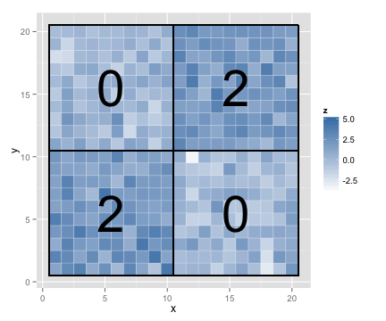

## Classical Change Point Problem ##
### Example 2

 

--- 

## Existing Works ##
- Bai and Perron (2003), Zeileis, et al. (2001) - regression change points via `library(strucchange)`
- Fearnhead (2005) - Bayesian regression change points
- Loschi, et al. (2010) - Bayesian regression change points
- Killick and Eckley (2011) - univariate mean or variance change points via `library(changepoint)`
- Ross (2012) - distributional univariate change points via `library(cpm)`
- Matteson and James (2013) - multivariate change points via `library(ecp)`
- ... and others

--- &twocol

## Bayesian Change Point Analysis ##
### Barry & Hartigan (1993): A Product Partition Model

***left

  
Partition $\rho = (S_1,\dots, S_b)$
$$y_{i:i\in S}\sim N(\theta_S, \sigma^2)$$
$$ \theta_S|\mu_0, \sigma_0^2 \sim N\left(\mu_0, \frac{\sigma_0^2}{n_S}\right)$$

***right

  
$$\mu_0 \sim U(-\infty, \infty)$$
$$\pi(\sigma^2) \propto \frac{1}{\sigma^2}\;\;\;\;\sigma^2\in(0,\infty)$$
$$\pi(p) = \frac{1}{p_0}\;\;\;\;p\in (0,p_0)$$
$$\pi(w) = \frac{1}{w_0}\;\;\;\;w\in(0,w_0)$$

$$f(\rho|p) = p^{b-1} (1-p)^{n-b}$$

---

## Product Partition Models (PPMs) ##

### Hartigan (1990):
<q>
Product partition models assume that observations in different components of a random partition of the data are independent given the partition.</q>

 

i.e. $y_i$ in block $S_1$ is independent of $y_j$ in $S_2$ given partition $\rho$ and the other parameters.

--- &twocol

## Bayesian Change Point Analysis ##
- Univariate change point analysis (Barry & Hartigan 1992)
- Implemented by Erdman & Emerson (2007, 2008) in `library(bcp)`

*** left 
### Example 1 (revisited)
 

*** right
### Example 1 (`bcp` output)
 

--- .segue .dark

## Extensions

--- &twocol

## Simple linear regression ##

*** left 
### Example 3
 

*** right
### Example 3 (change point output)
 

--- &twocol

## Multivariate change point

*** left 

### Example 4

 

*** right

### Example 4 (change point output)

 

--- .segue .dark

## Moving to a Grid

--- &twocol

## Change Points on a Grid##
### Barry and Hartigan (1995) and X. Wang and J. Emerson (2013)
*** left 

### Example 5

 

*** right

### Example 5 (change point output)

 

--- &twocol
## Change Points on a Grid ##
What does it mean to have a change point on a grid?

*** left
### In 1 dimension

 

*** right
### In 2 dimensions

 

---
## Change Points on a Grid ##
How does the model differ?
>  - Boundary length $l(\rho)$

  
  $$ f(\rho)\propto \alpha^{l(\rho)} \;\;\;\;\; \alpha\in(0,1)$$

>  - Small $\alpha$ encourages shorter boundaries
>  - Results are very sensitive to choice of $\alpha$ 

--- &twocol

## Application
### Image Restoration

*** left
### Example 6

*** right
### Example 6 (change point output)

--- &twocol

## Application
### Image Segmentation

*** left
### Example 6

*** right
### Example 6 (boundaries)

--- &twocol

## From Grid to Graph

*** left
### Example 7

 

*** right
### Example 7 (change point output)

 

--- .segue .dark

## Future Directions

--- 

## Where We're Headed
1. Extending the graphical change point method to multivariate data.
2. Extending the graphical change point method to fitting regressions.
3. Packaging it all up into publicly available R package(s).

--- .segue .dark

## Thank You ##

--- 

## Acknowledgements
I would like to thank my advisors Jay Emerson and Joseph Chang for their 
support and neverending wealth of ideas. Also, I would also like to thank my academic
grandfather for pioneering the concept of product partition models.

---

## References

- Barry, Daniel, and John A. Hartigan. "A Bayesian analysis for change point problems." Journal of the American Statistical Association 88.421 (1993): 309-319.
- Hartigan, John A. "Partition models." Communications in Statistics-Theory and Methods 19.8 (1990): 2745-2756.
- Erdman, Chandra, and John W. Emerson. "bcp: An R package for performing a Bayesian analysis of change point problems." Journal of Statistical Software 23.3 (2007): 1-13.
- Erdman, Chandra, and John W. Emerson. "A fast Bayesian change point analysis for the segmentation of microarray data." Bioinformatics 24.19 (2008): 2143-2148.
- Matteson, David S., and Nicholas A. James. "A nonparametric approach for multiple change point analysis of multivariate data." arXiv preprint arXiv:1306.4933 (2013).
- Bai, Jushan, and Pierre Perron. "Computation and analysis of multiple structural change models." Journal of Applied Econometrics 18.1 (2003): 1-22.
- Zeileis, Achim, et al. "strucchange. An R package for testing for structural change in linear regression models." (2001).

---

## References
- Loschi, Rosangela H., Jeanne G. Pontel, and Frederico RB Cruz. "Multiple change-point analysis for linear regression models." Chilean Journal of Statistics 1 (2010): 93-112.
- Fearnhead, Paul. "Exact Bayesian curve fitting and signal segmentation." Signal Processing, IEEE Transactions on 53.6 (2005): 2160-2166.
- Killick, Rebecca, and Idris A. Eckley. "Changepoint: an R package for changepoint analysis." Lancaster University (2011).
- Ross, Gordon J. "Parametric and Nonparametric Sequential Change Detection in R: The cpm package." Journal of Statistical Software, 2012.
- Hegarty, Avril, and Daniel Barry. "Bayesian disease mapping using product partition models." Statistics in medicine 27.19 (2008): 3868-3893.
